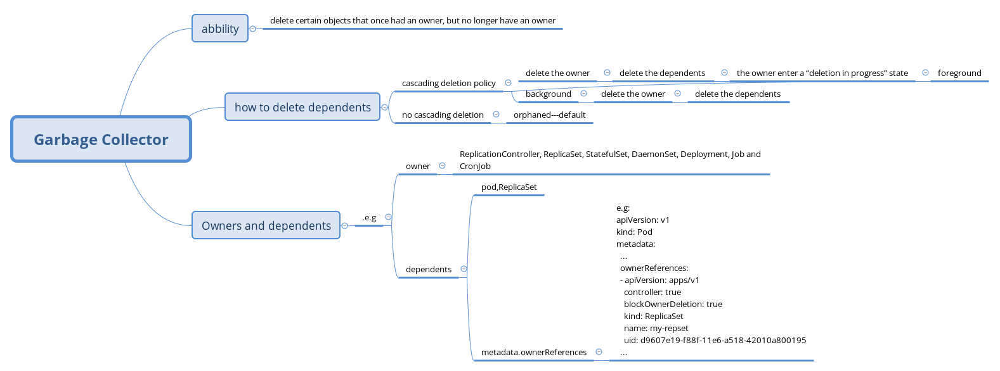

## Garbage Collection

instruction: https://kubernetes.io/docs/concepts/workloads/controllers/garbage-collection/

## mindmap



## e.g

I use the steps bellow to explation principle of gc

### 1. create the deployment

```yaml
apiVersion: apps/v1
kind: Deployment
metadata:
  name: nginx-deployment
  labels:
    app: nginx
spec:
  replicas: 3
  selector:
    matchLabels:
      app: nginx
  template:
    metadata:
      labels:
        app: nginx
    spec:
      containers:
      - name: nginx
        image: nginx:1.14.2
        ports:
        - containerPort: 80
```

### 2. delete the rs 

- prepare : I stop the kubelet so the pod belong to rs will be not deleted
- delete the resource with the propagationPloicy equel to 'Foreground'

```bash
curl -X DELETE localhost:8080/apis/extensions/v1beta1/namespaces/default/deployments/nginx-deployment   -d '{"kind":"DeleteOptions","apiVersion":"v1","propagationPolicy":"Orphan"}'   -H "Content-Type: application/json"
```

- the result:

```bash
(base) frankie@frankie-XPS-15-9550:~/Documents/test$kubectl get pod
NAME                                READY   STATUS    RESTARTS   AGE
nginx-deployment-57d9684bf8-bnx88   1/1     Running   0          35m
nginx-deployment-57d9684bf8-nxnr6   1/1     Running   0          35m
nginx-deployment-57d9684bf8-q4zj2   1/1     Running   0          35m
(base) frankie@frankie-XPS-15-9550:~/Documents/test$ kubectl get rs
NAME                          DESIRED   CURRENT   READY   AGE
nginx-deployment-57d9684bf8   3         3         3       2m40s
(base) frankie@frankie-XPS-15-9550:~/Documents/test$ kubectl get deploy
No resources found.
```

It show that only the deployment resource was deleted

- I try to delete without DeleteOptions the result is as same as the Orhoan delete

- then i delete the replicaset with the deleteOptions in Background mode

- the result:

```bash
curl -X DELETE localhost:8080/apis/extensions/v1beta1/namespaces/default/replicasets/nginx-deployment-57d9684bf8   -d '{"kind":"DeleteOptions","apiVersion":"v1","propagationPolicy":"Background"}'   -H "Content-Type: application/json"
{
  "kind": "Status",
  "apiVersion": "v1",
  "metadata": {
    
  },
  "status": "Success",
  "details": {
    "name": "nginx-deployment-57d9684bf8",
    "group": "extensions",
    "kind": "replicasets",
    "uid": "2dd60847-9bfe-11ea-bb4e-0242ac110002"
  }
}
(base) frankie@frankie-XPS-15-9550:~/Documents/test$ kubectl get rs
No resources found.
(base) frankie@frankie-XPS-15-9550:~/Documents/test$ kubectl get pod
No resources found.
```

Now both the pods and the replicaset were deleted

- i create deployment aggain and delete the deployment in Orphan mode
- then i stop the kubelet in the worker node
- and i delete the replicaset with the deleteOptions in Foreground mode

```bash
curl -X DELETE localhost:8080/apis/extensions/v1beta1/namespaces/default/replicasets/nginx-deployment-57d9684bf8   -d '{"kind":"DeleteOptions","apiVersion":"v1","propagationPolicy":"Foreground"}'   -H "Content-Type: application/json"
{
  "kind": "ReplicaSet",
  "apiVersion": "extensions/v1beta1",
  "metadata": {
    "name": "nginx-deployment-57d9684bf8",
    "namespace": "default",
    "selfLink": "/apis/extensions/v1beta1/namespaces/default/replicasets/nginx-deployment-57d9684bf8",
    "uid": "7d7d0e06-9c00-11ea-bb4e-0242ac110002",
    "resourceVersion": "533795",
    "generation": 2,
    "creationTimestamp": "2020-05-22T07:47:30Z",
    "deletionTimestamp": "2020-05-22T07:48:11Z",
    "deletionGracePeriodSeconds": 0,
    ....
    "finalizers": [
      "foregroundDeletion"
    ]
  }
  ....
}
(base) frankie@frankie-XPS-15-9550:~/Documents/test$ kubectl get rs
NAME                          DESIRED   CURRENT   READY   AGE
nginx-deployment-57d9684bf8   3         0         0       45s
(base) frankie@frankie-XPS-15-9550:~/Documents/test$ kubectl get pod
NAME                                READY   STATUS        RESTARTS   AGE
nginx-deployment-57d9684bf8-2gw5l   1/1     Terminating   0          49s
nginx-deployment-57d9684bf8-426nv   0/1     Terminating   0          49s
nginx-deployment-57d9684bf8-jk5xm   1/1     Terminating   0          49s
```

We see that the ReplicaSet resouce was tag with the finalizers and the rs was not deleted because pods not stoped

then lets start the kubelet and the result:

```bash
(base) frankie@frankie-XPS-15-9550:~/Documents/test$ kubectl get pod
NAME                                READY   STATUS        RESTARTS   AGE
nginx-deployment-57d9684bf8-2gw5l   0/1     Terminating   0          6m38s
(base) frankie@frankie-XPS-15-9550:~/Documents/test$ kubectl get rs
No resources found.
(base) frankie@frankie-XPS-15-9550:~/Documents/test$ kubectl get pod
No resources found.
```

Now both the rs and the pods were deleted

### intresting thing

When i created the deploy and deleted the dpeloy with the foregroud mode imadiertaly.
the result:

```bash
(base) frankie@frankie-XPS-15-9550:~/Documents/test$ kubectl get deploy
NAME               READY   UP-TO-DATE   AVAILABLE   AGE
nginx-deployment   0/3     0            0           2m43s
(base) frankie@frankie-XPS-15-9550:~/Documents/test$ kubectl get rs
NAME                          DESIRED   CURRENT   READY   AGE
nginx-deployment-57d9684bf8   3         0         0       2m45s
(base) frankie@frankie-XPS-15-9550:~/Documents/test$ kubectl get pod
NAME                                READY   STATUS        RESTARTS   AGE
nginx-deployment-57d9684bf8-7qbh9   1/1     Terminating   0          2m49s
```

The rs was also taged by the finalizers with foregroundDeletion
