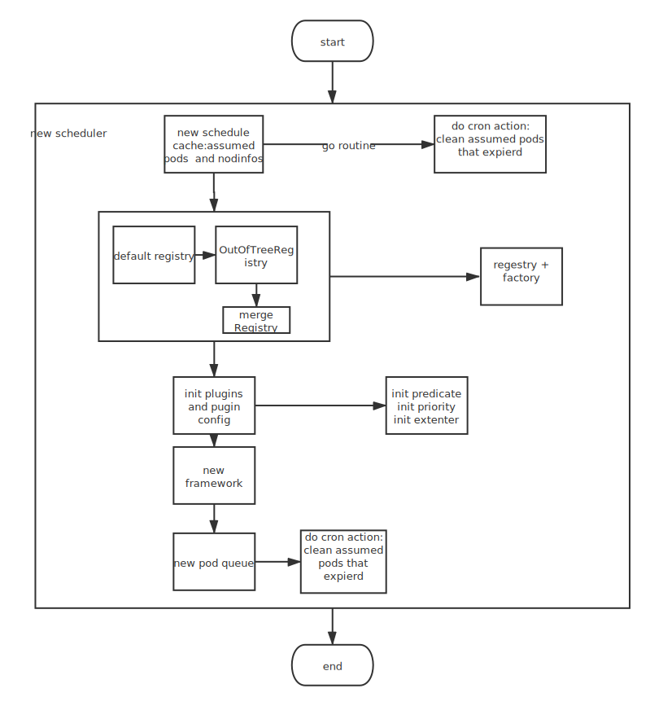
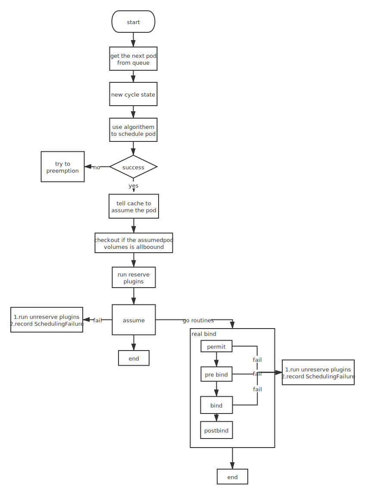

kubernetes 调度器

调度器作为一个独立运行的master节点组件，通过与API server交互来获取新创建的pod资源和每个node信息的变化，以此来为新的pod选择一个最优秀的节点进行部署。

## 代码结构

代码框架可以分为三层:初始化配置，架构，算法

### 初始化配置

程序入口

- cmd/kube-scheduler/scheduler.go为程序的入口，和其他组件一样依赖"github.com/spf13/pflag"来实现参数的配置和程序的执行

核心代码：

``` golang

// Run executes the scheduler based on the given configuration. It only returns on error or when context is done.
func Run(ctx context.Context, cc schedulerserverconfig.CompletedConfig, outOfTreeRegistryOptions ...Option) error {
    ......

    // 外部插件注册
        outOfTreeRegistry := make(framework.Registry)
        for _, option := range outOfTreeRegistryOptions {
                if err := option(outOfTreeRegistry); err != nil {
                        return err
                }
    }

    ......

        // 创建scheduler实例
        sched, err := scheduler.New(cc.Client,
                cc.InformerFactory,
                cc.PodInformer,
                cc.Recorder,
        ctx.Done(),
    ......

        // 准备事件广播器
        if cc.Broadcaster != nil && cc.EventClient != nil {
                cc.Broadcaster.StartRecordingToSink(ctx.Done())
        }
        if cc.CoreBroadcaster != nil && cc.CoreEventClient != nil {
                cc.CoreBroadcaster.StartRecordingToSink(&corev1.EventSinkImpl{Interface: cc.CoreEventClient.Events("")})
        }
    // 启动健康检查以及监控指标服务
        if cc.InsecureServing != nil {
                separateMetrics := cc.InsecureMetricsServing != nil
                handler := buildHandlerChain(newHealthzHandler(&cc.ComponentConfig, separateMetrics, checks...), nil, nil)
                if err := cc.InsecureServing.Serve(handler, 0, ctx.Done()); err != nil {
                        return fmt.Errorf("failed to start healthz server: %v", err)
                }
    }
        ......

        // 启动informer来watch pod以及其他资源的状况
        go cc.PodInformer.Informer().Run(ctx.Done())
        cc.InformerFactory.Start(ctx.Done())

        // Wait for all caches to sync before scheduling.
        cc.InformerFactory.WaitForCacheSync(ctx.Done())

        // 开启选举机制
        if cc.LeaderElection != nil {
                cc.LeaderElection.Callbacks = leaderelection.LeaderCallbacks{
                        OnStartedLeading: sched.Run,
                        OnStoppedLeading: func() {
                                klog.Fatalf("leaderelection lost")
            },
        .......

        // 执行调度架构
        sched.Run(ctx)
    return fmt.Errorf("finished without leader elect")
}

```

总结

- 通过option的方式配置基础选项
- 使用out of tree的方式添加插件和扩展资源类型

### 调度架构（framework）

1 调度架构负责提供pod、node等信息以及获取资源所需的client等信息，
2 pulgin对象的通过实现相应pugin接口来实现自己的能力，plugin可以分为以下类型：

- QueueSortPlugin
- PreFilterPlugin
- FilterPlugin
- PostFilterPlugin
- ScorePlugin
- PreBindPlugin
- BindPlugin
- PostBindPlugin
- PermitPlugin

framework会按照顺序去执行相应类型的plugin

架构初始化流程图：


- framework 初始化过程重点在于plugin加载，plugin里会对应相应的预选算法和优选算法

#### cache

- pkg/scheduler/internal/cache/cache.go，存储pod和node的信息,已经找到最有node的pod会在cache里更新，从而继续执行调度，pod启动一个新的协程进行bind

#### queue

- queue用来缓存正在调度的pod信息

#### event

- 用来事件通知

### 调度

- 调度设计为每次调度一个pod，其他pod排队

#### 调度执行流程

``` null
    +---------------------------------------------+
    |               Schedulable nodes:            |
    |                                             |
    | +--------+    +--------+      +--------+    |
    | | node 1 |    | node 2 |      | node 3 |    |
    | +--------+    +--------+      +--------+    |
    |                                             |
    +-------------------+-------------------------+
                        |
                        |
                        v
    +-------------------+-------------------------+

    Pred. filters: node 3 doesn't have enough resource

    +-------------------+-------------------------+
                        |
                        |
                        v
    +-------------------+-------------------------+
    |             remaining nodes:                |
    |   +--------+                 +--------+     |
    |   | node 1 |                 | node 2 |     |
    |   +--------+                 +--------+     |
    |                                             |
    +-------------------+-------------------------+
                        |
                        |
                        v
    +-------------------+-------------------------+

    Priority function:    node 1: p=2
                          node 2: p=5

    +-------------------+-------------------------+
                        |
                        |
                        v
            select max{node priority} = node 2
```

架构初始化流程图：


## 调度算法分析

## 调度器扩展